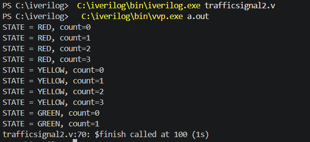

# Traffic Light Controller using Verilog

## Overview

This project implements a Traffic Light Controller using Verilog HDL.

The design is based on:

* Finite State Machine (FSM)
* Counter-based timing control
* Sequential logic concepts

## States

| State  | Binary Value |
| ------ | ------------ |
| RED    | 00           |
| YELLOW | 01           |
| GREEN  | 10           |

## Features

* Clock-driven state transitions
* Counter-based delays
* FSM implementation in Verilog
* Simulation using Icarus Verilog

## Tools Used

* Verilog HDL
* Icarus Verilog
* VS Code

## State Flow

RED → YELLOW → GREEN → RED

## Simulation output 
  
## Learning Outcomes

* Understanding FSM design
* Working with registers and counters
* Clock and timing concepts
* Verilog simulation and debugging
